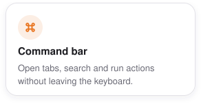
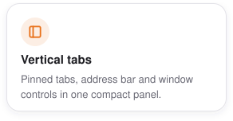
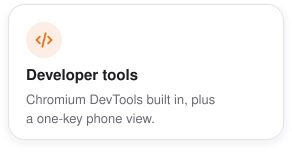
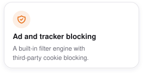
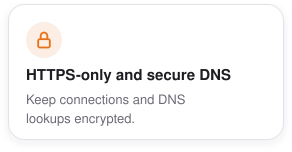
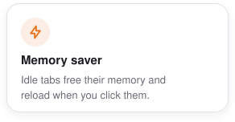

<div align="center">
  <picture>
    <source media="(prefers-color-scheme: dark)" srcset="design/readme/wordmark-dark.png">
    
  </picture>

  <p>
    <strong>A keyboard-first Chromium browser built for developers on macOS.</strong><br>
    Vertical tabs, a fast command bar, built-in ad and tracker blocking,<br>and developer tools without the usual browser chrome.
  </p>

  <p>
    <a href="https://github.com/YSamed/yalqen/releases/latest"><picture><source media="(prefers-color-scheme: dark)" srcset="design/readme/download-dmg-dark.png"></picture></a>
    <a href="#install"><picture><source media="(prefers-color-scheme: dark)" srcset="design/readme/install-homebrew-dark.png"></picture></a>
    <br>
    <a href="https://github.com/YSamed/yalqen/releases/latest"><picture><source media="(prefers-color-scheme: dark)" srcset="https://ysamed.github.io/yalqen/release-dark.svg"></picture></a>
  </p>

  <p>
    <sub>
      <a href="https://yalqen.com/?utm_source=github&amp;utm_medium=readme">Website</a> ·
      <a href="apps/browser/CHANGELOG.md">Changelog</a> ·
      <a href="CONTRIBUTING.md">Contribute</a> ·
      <a href="README.tr.md">Türkçe</a> ·
      <a href="README.zh-CN.md">简体中文</a>
    </sub>
  </p>
</div>

<p align="center">
  <a href="https://yalqen.com/?utm_source=github&amp;utm_medium=readme"></a>
</p>

## Features

Yalqen is for developers who want Chromium compatibility without a browser UI getting in the way.

<p align="center">
  <picture><source media="(prefers-color-scheme: dark)" srcset="design/readme/cards/command-dark.svg"></picture>
  <picture><source media="(prefers-color-scheme: dark)" srcset="design/readme/cards/tabs-dark.svg"></picture>
  <picture><source media="(prefers-color-scheme: dark)" srcset="design/readme/cards/devtools-dark.svg"></picture>
  <br>
  <picture><source media="(prefers-color-scheme: dark)" srcset="design/readme/cards/blocking-dark.svg"></picture>
  <picture><source media="(prefers-color-scheme: dark)" srcset="design/readme/cards/https-dark.svg"></picture>
  <picture><source media="(prefers-color-scheme: dark)" srcset="design/readme/cards/memory-dark.svg"></picture>
</p>


## Install

<picture><source media="(prefers-color-scheme: dark)" srcset="design/readme/cards/requirements-dark.svg"></picture>

```bash
brew install --cask YSamed/yalqen/yalqen
```

<sub>Prefer a disk image? [Download the latest DMG](https://github.com/YSamed/yalqen/releases/latest).</sub>

<br>

<p align="center"><sub><a href="docs/README.md">Technical details</a> · <a href="CONTRIBUTING.md">Contributing</a> · <a href="SECURITY.md">Security</a> · <a href="LICENSE">MIT License</a></sub></p>

<p align="center"><sub>If Yalqen is useful to you, star the repository. It helps other developers discover the project.</sub></p>
