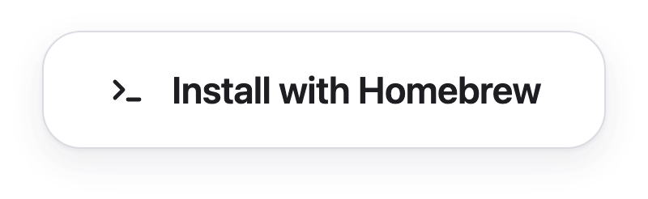
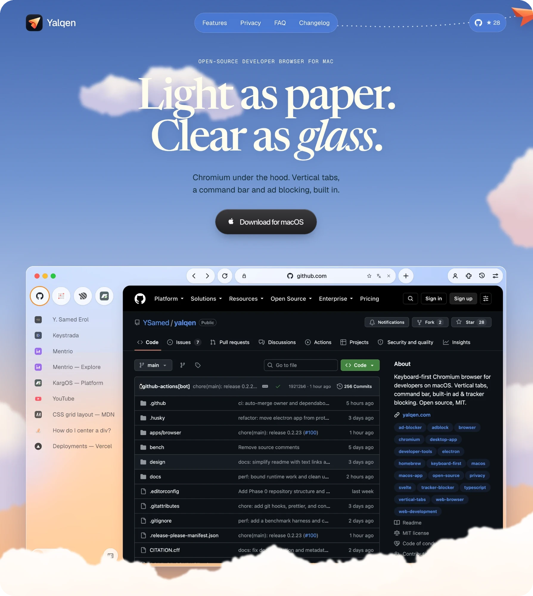
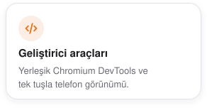

<div align="center">
  <picture>
    <source media="(prefers-color-scheme: dark)" srcset="assets/readme/wordmark-dark.png">
    
  </picture>

  <p>
    <strong>macOS'ta geliştiriciler için klavye öncelikli Chromium tarayıcısı.</strong><br>
    Dikey sekmeler, hızlı komut çubuğu, yerleşik reklam ve izleyici engelleme<br>ve gereksiz arayüzden arınmış geliştirici araçları.
  </p>

  <p>
    <a href="https://yalqen.com/download"><picture><source media="(prefers-color-scheme: dark)" srcset="assets/readme/download-dmg-dark.png"></picture></a>
    <a href="#kurulum"><picture><source media="(prefers-color-scheme: dark)" srcset="assets/readme/install-homebrew-dark.png"></picture></a>
    <br>
    <a href="https://github.com/YSamed/yalqen/releases/latest"><picture><source media="(prefers-color-scheme: dark)" srcset="https://ysamed.github.io/yalqen/release-dark.svg"></picture></a>
  </p>

  <p>
    <sub>
      <a href="https://yalqen.com/?utm_source=github&amp;utm_medium=readme">Web sitesi</a> ·
      <a href="apps/browser/CHANGELOG.md">Değişiklik günlüğü</a> ·
      <a href=".github/CONTRIBUTING.md">Katkıda bulun</a> ·
      <a href="https://github.com/YSamed/yalqen/issues">Hata bildir</a> ·
      <a href="README.md">English</a> ·
      <a href="README.zh-CN.md">简体中文</a>
    </sub>
  </p>
</div>

<p align="center">
  <a href="https://yalqen.com/?utm_source=github&amp;utm_medium=readme"></a>
</p>

## Özellikler

Yalqen, tarayıcı arayüzü yoluna çıkmadan Chromium uyumluluğu isteyen geliştiriciler için.

<p align="center">
  <picture><source media="(prefers-color-scheme: dark)" srcset="assets/readme/cards/command-dark.tr.svg"></picture>
  <picture><source media="(prefers-color-scheme: dark)" srcset="assets/readme/cards/tabs-dark.tr.svg"></picture>
  <picture><source media="(prefers-color-scheme: dark)" srcset="assets/readme/cards/devtools-dark.tr.svg"></picture>
  <br>
  <picture><source media="(prefers-color-scheme: dark)" srcset="assets/readme/cards/blocking-dark.tr.svg"></picture>
  <picture><source media="(prefers-color-scheme: dark)" srcset="assets/readme/cards/https-dark.tr.svg"></picture>
  <picture><source media="(prefers-color-scheme: dark)" srcset="assets/readme/cards/memory-dark.tr.svg"></picture>
</p>

Tüm [klavye kısayollarına](docs/keyboard-shortcuts.tr.md) göz atın. Yalqen ayrıca yedi yerleşik arama motoruyla gelir.

## Kurulum

<picture><source media="(prefers-color-scheme: dark)" srcset="assets/readme/cards/requirements-dark.tr.svg"></picture>

```bash
brew install --cask YSamed/yalqen/yalqen
```

<sub>Disk görüntüsünü mü tercih edersiniz? [Son DMG dosyasını indirin](https://yalqen.com/download).</sub>

<br>

<p align="center"><sub><a href="docs/README.tr.md">Teknik ayrıntılar</a> · <a href=".github/CONTRIBUTING.md">Katkıda bulunma</a> · <a href=".github/SECURITY.md">Güvenlik</a> · <a href="LICENSE">MIT Lisansı</a></sub></p>

<p align="center"><sub>Yalqen işinize yarıyorsa depoya yıldız verin. Projenin başka geliştiricilere ulaşmasına yardımcı olur.</sub></p>
