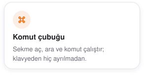
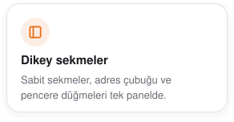
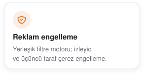
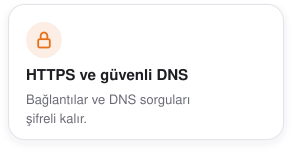

<div align="center">
  <picture>
    <source media="(prefers-color-scheme: dark)" srcset="design/readme/wordmark-dark.png">
    
  </picture>

  <p>
    <strong>macOS'ta geliştiriciler için klavye öncelikli Chromium tarayıcısı.</strong><br>
    Dikey sekmeler, hızlı komut çubuğu, yerleşik reklam ve izleyici engelleme<br>ve gereksiz arayüzden arınmış geliştirici araçları.
  </p>

  <p>
    <a href="https://github.com/YSamed/yalqen/releases/latest"><picture><source media="(prefers-color-scheme: dark)" srcset="design/readme/download-dmg-dark.png"></picture></a>
    <a href="#kurulum"><picture><source media="(prefers-color-scheme: dark)" srcset="design/readme/install-homebrew-dark.png"></picture></a>
    <br>
    <a href="https://github.com/YSamed/yalqen/releases/latest"><picture><source media="(prefers-color-scheme: dark)" srcset="https://raw.githubusercontent.com/YSamed/yalqen/badges/release-dark.svg"></picture></a>
  </p>

  <p>
    <sub>
      <a href="https://yalqen.com/?utm_source=github&amp;utm_medium=readme">Web sitesi</a> ·
      <a href="apps/browser/CHANGELOG.md">Değişiklik günlüğü</a> ·
      <a href="CONTRIBUTING.md">Katkıda bulun</a> ·
      <a href="https://github.com/YSamed/yalqen/issues">Hata bildir</a> ·
      <a href="README.md">English</a> ·
      <a href="README.zh-CN.md">简体中文</a>
    </sub>
  </p>
</div>

<p align="center">
  <a href="https://yalqen.com/?utm_source=github&amp;utm_medium=readme"><picture><source media="(prefers-color-scheme: dark)" srcset="design/screenshots/website-dark.png"></picture></a>
</p>

## Özellikler

Yalqen, tarayıcı arayüzü yoluna çıkmadan Chromium uyumluluğu isteyen geliştiriciler için.

<p align="center">
  <picture><source media="(prefers-color-scheme: dark)" srcset="design/readme/cards/command-dark.tr.svg"></picture>
  <picture><source media="(prefers-color-scheme: dark)" srcset="design/readme/cards/tabs-dark.tr.svg"></picture>
  <picture><source media="(prefers-color-scheme: dark)" srcset="design/readme/cards/devtools-dark.tr.svg"></picture>
  <br>
  <picture><source media="(prefers-color-scheme: dark)" srcset="design/readme/cards/blocking-dark.tr.svg"></picture>
  <picture><source media="(prefers-color-scheme: dark)" srcset="design/readme/cards/https-dark.tr.svg"></picture>
  <picture><source media="(prefers-color-scheme: dark)" srcset="design/readme/cards/memory-dark.tr.svg"></picture>
</p>

Tüm [klavye kısayollarına](docs/keyboard-shortcuts.tr.md) göz atın. Yalqen ayrıca yedi yerleşik arama motoruyla gelir.

## Kurulum

> [!NOTE]
> macOS 13 veya üzeri ve Apple Silicon gerekir.

```bash
brew install --cask YSamed/yalqen/yalqen
```

Ya da DMG dosyasını [Releases](https://github.com/YSamed/yalqen/releases/latest) sayfasından indirin. Uygulama imzalı ve notarize edilmiştir, kendini güncel tutar.

<details>
<summary>Güncelleme, kaldırma ve kullanım ölçümü</summary>

Güncellemeyi Homebrew ile yapmak için:

```bash
brew upgrade --cask yalqen
```

Kaldırmak ve verilerini silmek için:

```bash
brew uninstall --zap --cask yalqen
```

Aktif kurulum ölçümü varsayılan olarak kapalıdır, **Ayarlar → Gizlilik** bölümünden açılabilir. [Rozet sayaçlarının ayrıntıları](docs/usage-measurement.md).

</details>

## Geliştirme

```bash
cd apps/browser
npm ci
npm start
```

Node.js 22.12 veya üzeri gerekir. Kontroller ve pull request'ler için [CONTRIBUTING.md](CONTRIBUTING.md) dosyasına bakın.

---

<p align="center"><sub><a href="LICENSE">MIT Lisansı</a> · Filtre listeleri <a href="apps/browser/THIRD_PARTY_NOTICES.md">kendi lisanslarını</a> korur · Yalqen adı ve logosu MIT Lisansı kapsamında değildir</sub></p>

<p align="center"><sub>Yalqen işinize yarıyorsa depoya yıldız verin. Projenin başka geliştiricilere ulaşmasına yardımcı olur.</sub></p>

<p align="center">
  <a href="https://github.com/YSamed/yalqen/actions/workflows/ci.yml"></a>
  <a href="https://github.com/YSamed/yalqen/actions/workflows/codeql.yml"></a>
  <a href="https://scorecard.dev/viewer/?uri=github.com/YSamed/yalqen"></a>
  <a href="https://yalqen.com/privacy#active-installations"></a>
</p>
