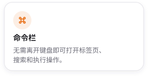
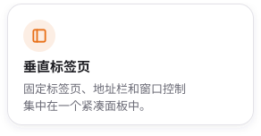
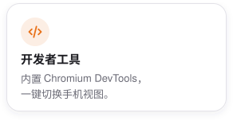
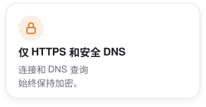
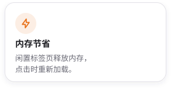

<div align="center">
  <picture>
    <source media="(prefers-color-scheme: dark)" srcset="design/readme/wordmark-dark.png">
    
  </picture>

  <p>
    <strong>面向 macOS 开发者的键盘优先 Chromium 浏览器。</strong><br>
    垂直标签页、快速命令栏、内置广告和跟踪器拦截，以及没有多余界面的开发者工具。
  </p>

  <p>
    <a href="https://yalqen.com/download"><picture><source media="(prefers-color-scheme: dark)" srcset="design/readme/download-dmg-dark.png"></picture></a>
    <a href="#安装"><picture><source media="(prefers-color-scheme: dark)" srcset="design/readme/install-homebrew-dark.png"></picture></a>
    <br>
    <a href="https://github.com/YSamed/yalqen/releases/latest"><picture><source media="(prefers-color-scheme: dark)" srcset="https://ysamed.github.io/yalqen/release-dark.svg"></picture></a>
  </p>

  <p>
    <sub>
      <a href="https://yalqen.com/?utm_source=github&amp;utm_medium=readme">官网</a> ·
      <a href="apps/browser/CHANGELOG.md">更新日志</a> ·
      <a href="CONTRIBUTING.md">参与贡献</a> ·
      <a href="README.md">English</a> ·
      <a href="README.tr.md">Türkçe</a>
    </sub>
  </p>
</div>

<p align="center">
  <a href="https://yalqen.com/?utm_source=github&amp;utm_medium=readme"></a>
</p>

## 功能

Yalqen 适合想要 Chromium 兼容性、又不想被浏览器界面干扰的开发者。

<p align="center">
  <picture><source media="(prefers-color-scheme: dark)" srcset="design/readme/cards/command-dark.zh-CN.svg"></picture>
  <picture><source media="(prefers-color-scheme: dark)" srcset="design/readme/cards/tabs-dark.zh-CN.svg"></picture>
  <picture><source media="(prefers-color-scheme: dark)" srcset="design/readme/cards/devtools-dark.zh-CN.svg"></picture>
  <br>
  <picture><source media="(prefers-color-scheme: dark)" srcset="design/readme/cards/blocking-dark.zh-CN.svg"></picture>
  <picture><source media="(prefers-color-scheme: dark)" srcset="design/readme/cards/https-dark.zh-CN.svg"></picture>
  <picture><source media="(prefers-color-scheme: dark)" srcset="design/readme/cards/memory-dark.zh-CN.svg"></picture>
</p>

查看全部[键盘快捷键](docs/keyboard-shortcuts.md)。Yalqen 还内置了七个搜索引擎。

## 安装

<picture><source media="(prefers-color-scheme: dark)" srcset="design/readme/cards/requirements-dark.zh-CN.svg"></picture>

```bash
brew install --cask YSamed/yalqen/yalqen
```

<sub>更喜欢磁盘映像？[下载最新 DMG](https://yalqen.com/download)。</sub>

<br>

<p align="center"><sub><a href="docs/README.zh-CN.md">技术细节</a> · <a href="CONTRIBUTING.md">参与贡献</a> · <a href="SECURITY.md">安全</a> · <a href="LICENSE">MIT 许可证</a></sub></p>

<p align="center"><sub>如果 Yalqen 对你有帮助，欢迎给仓库点个 Star，这能帮助更多开发者发现这个项目。</sub></p>
